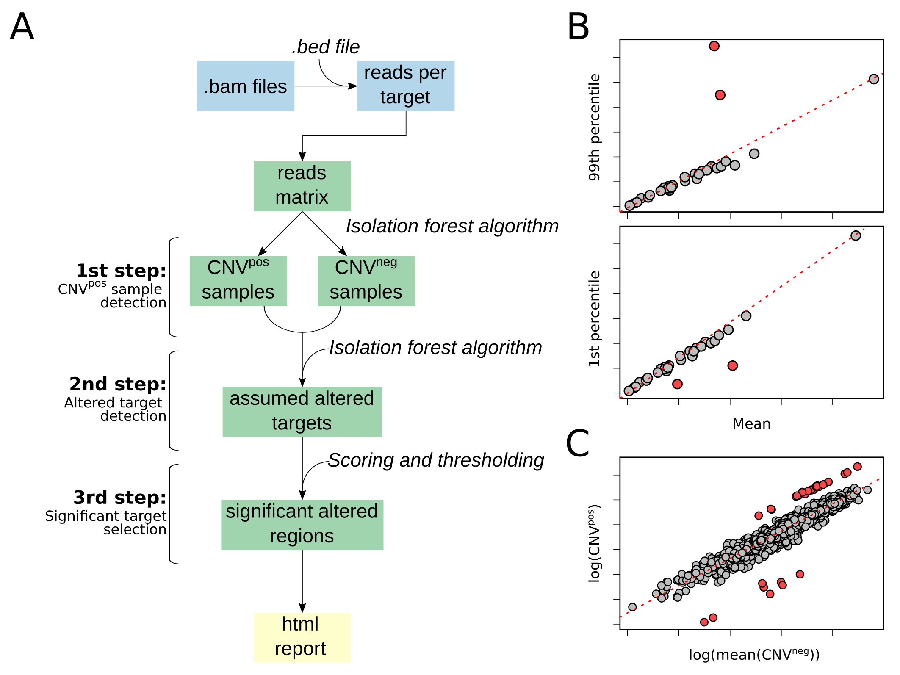
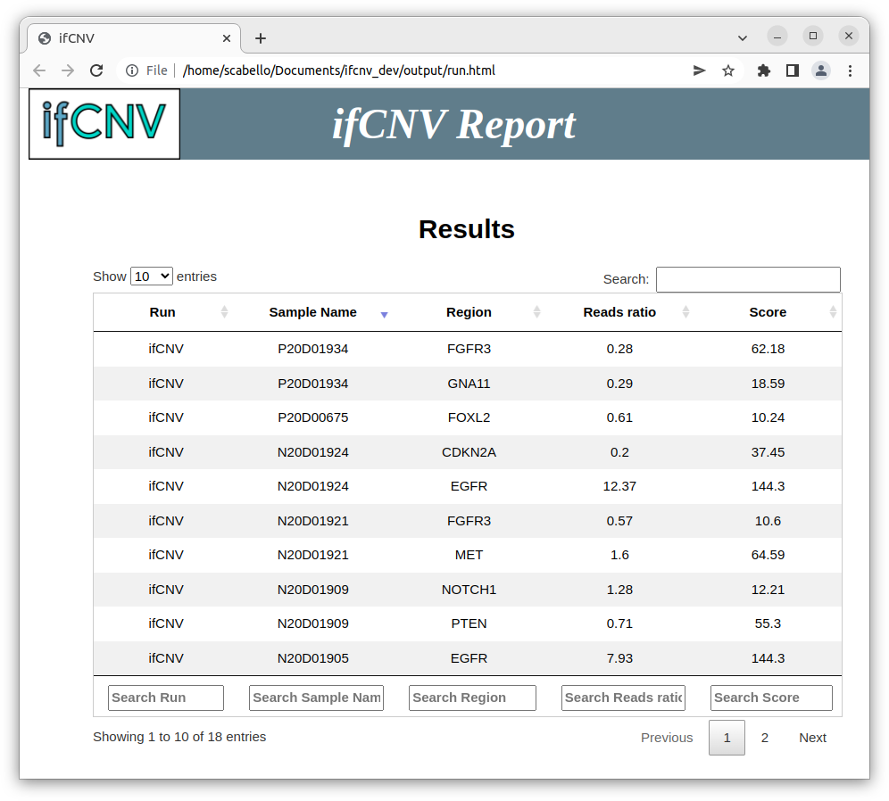
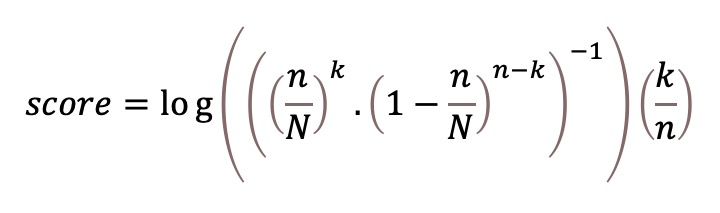
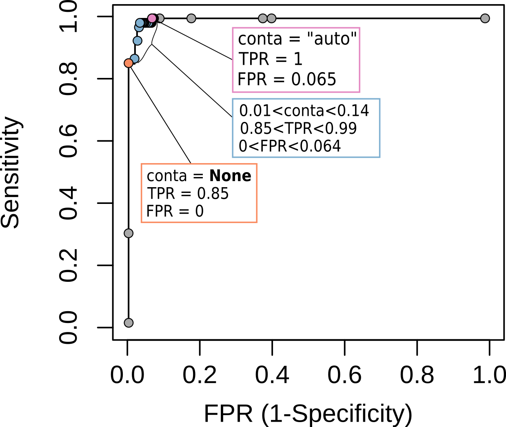

# ifCNV : a novel isolation-forest-based package to detect copy number variations from various targeted NGS datasets

## Installation

### From Conda (recommended)

1. Install Conda : [documentation here](https://docs.conda.io/projects/conda/en/latest/user-guide/install/index.html)
1. Create an envrionment : `conda create -n ifcnv`
1. Activate the environment : `conda activate ifcnv`
1. Install the package : `conda install -c conda-forge -c bioconda ifcnv`

### From PyPi

Make sure you have python >= 3.6

```sh
python --version
Python 3.X.X
```

Install pip : [documentation here](https://pip.pypa.io/en/stable/installation/).

```sh
python -m ensurepip --upgrade
```

Install [ifCNV](https://pypi.org/project/ifCNV/)

```sh
pip install ifCNV
```

## ifCNV workflow



ifCNV is a CNV detection tool based on read-depth distribution obtained from targeted NGS data (A). It integrates a pre-processing step to create a read-depth matrix using as input the aligned .bam files and a corresponding .bed file. This reads matrix is composed of the samples as columns and the targets as rows. Next, it uses an IF machine learning algorithm to detect the samples with a strong bias between the 99th percentile and the mean (for amplifications, B, top plot), and the 1st percentile and the mean (for deletions, B, bottom plot). These samples are assumed to be CNVpos. The samples with no bias, and therefore not detected by the IF as outliers, are considered as CNVneg samples. The reads matrix is normalized by dividing each column (i.e., the reads distribution of each sample) by its median. Then, ifCNV creates a mean normalized normal sample by averaging all the CNVneg samples. It is used as a reference to detect the outlying targets in each normalized CNVpos sample with a second IF (C). These assumed altered targets, are then used to compute the localization score per region of interest. Finally, a threshold is applied on this score to select the significantly altered regions that are compiled in an html report containing a table and a graph for easy user interpretation.

## Users Guide

### Basic usage

ifCNV stands for **i**solation **f**orest based **C**opy **N**umber **V**ariation detection. 

Its usage is meant to be approachable for entry-level users. ifCNV can be run on germline or somatic samples indifferently. It runs on the aligned files (.bam or .cram) of an entire targeted (capture or amplicon) sequencing run at once and requires at least three samples to be accurate.

```sh
ifCNV -i /path/to/bam/directory/ -b /path/to/bed/file -o /path/to/output/directory/
```

**ifCNV** input: 
- the aligned sequences (.bam or .cram files and their associated indexes)
- the genomic coordinates of the region of interest (a .bed file, see 
http://genome.cse.ucsc.edu/FAQ/FAQformat.html#format1 and below for more information).


**ifCNV** ouput:
- An html report

Some **BED file** informations:

The BED (Browser Extensible Data) format is a text file format used to store genomic regions as coordinates and associated annotations. The data are presented in the form of columns separated by spaces or tabs. This format was developed during the Human Genome Project and then adopted by other sequencing projects (source: wikipedia). For targeted sequencing, it is supposed to be provided by the vendor.

As it is of great importance for **ifCNV** let's see some key points:
- the BED file must have (at least) 4 columns, the three first are the coordinates of the baited genomic regions and the forth one is a string describing these regions.
- The forth column is the name of the targeted region and it must be set carefully as it will be used to compute the localization score (see the **Resolution** paragraph)

If you don’t have the capture regions BED file, but you do know which commercial exome capture kit was used to prepare your samples, you might find the file you need in Astra-Zeneca’s reference data repository. Otherwise, try searching the vendor’s website or contacting their customer support to obtain the right file.

### Interpretation of the html report:



- The 1st column is the run name (default is ifCNV, but it can be specified with the -r flag).
- The 2nd column is the sample name (by default the table is sorted by this column).
- The 3rd column is the name of the region (here a gene).
- The 4th column is the reads ratio (1<reads_ratio<2: gain, reads_ratio>2: amplification, reads_ratio<1: loss).
- The 5th column is the localization score.

The user can click on each line to visualize a graph of the normalized log ratio for the region of interest where each point represents a target.


### More specific commands

- if you want ifCNV to stop talking
```sh
ifCNV -i /path/to/bam/directory/ -b /path/to/bed/file -o /path/to/output/directory/ -v ''
```
- if you don't want ifCNV to automatically open the report
```sh
ifCNV -i /path/to/bam/directory/ -b /path/to/bed/file -o /path/to/output/directory/ -a ''
```
- if you don't want to re-create the reads matrix of your run at each
utilisation (ie. to rerun ifCNV with different parameters)
    - First, run ifCNV and write the reads matrix
    - Then, run ifCNV and tell it to take the reads matrix (it will skip its
    creation)

```sh
ifCNV -i /path/to/bam/directory/ -b /path/to/bed/file -o /path/to/output/directory/ -rm /path/to/readsMatrix/file

ifCNV -i /path/to/bam/directory/ -b /path/to/bed/file -o /path/to/output/directory/ -s /path/to/readsMatrix/file
```
- if you want to save the output in a .tsv file (it will be written in the
output directory)
```sh
ifCNV -i /path/to/bam/directory/ -b /path/to/bed/file -o /path/to/output/directory/ -sv True
```
- changing mode from 'fast' (default) to 'extensive'. In 'fast' mode, ifCNV tests the CNVpos samples against the intrarun reference created from all the CNVneg samples. In 'extensive' mode, ifCNV tests all the samples of the run against the reference.
```sh
ifCNV -i /path/to/bam/directory/ -b /path/to/bed/file -o /path/to/output/directory/ -m 'extensive'
```

### Exploring different scenari

#### Changing the resolution

The resolution of ifCNV is set in the .bed file. So, by changing he 4th column of the .bed file the user can easily change the resolution of ifCNV. 
ifCNV splits this name on the "\_" character and regroups whats on the left of it as the **region of interest**.

**A**:

```tsv
chr4	55155143	55155306	4q12_PDGFRA_E21_STA101436	0	+	55155159	55155287	113,255,0
chr4	55156535	55156697	4q12_PDGFRA_E22_STA101437	0	+	55156551	55156681	113,255,0
chr4	55161233	55161388	4q12_PDGFRA_E23_STA101438	0	+	55161253	55161366	113,255,0
chr4	55524153	55524297	4q12_KIT_E1_STA101439	0	+	55524170	55524281	85,255,0
chr4	55561669	55561832	4q12_KIT_E2_STA101440	0	+	55561686	55561810	85,255,0
chr4	55564526	55564689	4q12_KIT_E3_STA101441	0	+	55564544	55564675	85,255,0
```
In this .bed file, the 4th column (ie the name of the target) is composed of 4 elements separated by a "\_". The first one (4q12) is the chromosome arm;
the second one (PDGRA & KIT) is the gene name; the third one is the exon number and the forth one is the target name.
Using this .bed file, the resolution will be at the chromosome arm level, meaning the six
targets will be considered as belonging to the same **region of interest** (4q12) in the calculus of the localisation score and in the output. 

**B**:

The user can increase the resolution by changing the separating character. For example:
```tsv
chr4	55155143	55155306	4q12-PDGFRA_E21_STA101436	0	+	55155159	55155287	113,255,0
chr4	55156535	55156697	4q12-PDGFRA_E22_STA101437	0	+	55156551	55156681	113,255,0
chr4	55161233	55161388	4q12-PDGFRA_E23_STA101438	0	+	55161253	55161366	113,255,0
chr4	55524153	55524297	4q12-KIT_E1_STA101439	0	+	55524170	55524281	85,255,0
chr4	55561669	55561832	4q12-KIT_E2_STA101440	0	+	55561686	55561810	85,255,0
chr4	55564526	55564689	4q12-KIT_E3_STA101441	0	+	55564544	55564675	85,255,0
```

Using this .bed file, the resolution will be at the gene level, meaning the 3
first targets will be considered as belonging to the same region (4q12-PDGFRA) and the 3
last to another **region of interest** (4q12-KIT) in the calculus of the localization score and in the output.

**C**:

Again, in this example, the user can increase the resolution by changing the separating character:

```tsv
chr4	55155143	55155306	4q12-PDGFRA-E21_STA101436	0	+	55155159	55155287	113,255,0
chr4	55156535	55156697	4q12-PDGFRA-E22_STA101437	0	+	55156551	55156681	113,255,0
chr4	55161233	55161388	4q12-PDGFRA-E23_STA101438	0	+	55161253	55161366	113,255,0
chr4	55524153	55524297	4q12-KIT-E1_STA101439	0	+	55524170	55524281	85,255,0
chr4	55561669	55561832	4q12-KIT-E2_STA101440	0	+	55561686	55561810	85,255,0
chr4	55564526	55564689	4q12-KIT-E3_STA101441	0	+	55564544	55564675	85,255,0
```
Using this .bed file, the resolution will be at the exon level, meaning each target will be considered as belonging to a single **region of interest** (ie 4q12-PDGFRA-E21).

##### Localization score

Specific regions of biological significance (gene or exon) can be covered by several targets. In the event that a region is altered, all the targets in the region should be modified. By contrast, if only one target in the region is modified, it is likely to be a FP. We integrated this reasoning to develop a localisation score in order to reduce the number of FPs. The localisation score depends on the number of modified targets in the region, the number of targets in the region and the total number of targets in the panel. A semi-open log scale incorporating the ratio of modified targets in the region was chosen. It is calculated as follows:

<p align="center"></p>

*whith k the number of modified targets on the region, n the number of targets on the region, N the total number of targets.*

This score is thresholded to keep only the significant regions, by default the threshold is 10. However, it can be useful for the user to change that threshold regarding the design of the experiment. 

For example, in the first case (**A**), 6 targets are on the same region, this means that with a panel of 1000 targets the score will range from 0.86 to 30.7 depending on the number of outlying targets detected:

|Number of outlying targets|Localization score|
|--------------------------|------------------|
|0|0|
|1|0.87|
|2|3.42|
|3|7.68|
|4|13.65|
|5|21.32|
|6|30.7|

With a score threshold (-sT) at 10, ifCNV will consider the region significantly altered if 4 targets are.

In the second case (**B**), 3 targets are in the same region, for the same panel (1000 targets) the score will range from 1.94 to 17.42:

|Number of outlying targets|Localization score|
|--------------------------|------------------|
|0|0|
|1|1.94|
|2|7.75|
|3|17.42|

Which means that the region will be considered altered if all three regions are detected as outliers.

In the third case (**C**), there is only one target per region, meaning that the localisation score will be either 0 or 6.91.

ifCNV will never consider the regions as altered if the user doesn't change the score threshold (-sT flag).

The command in this case will be:

```sh
ifCNV -i /path/to/bam/directory/ -b /path/to/bed/file -o /path/to/output/directory/ -sT 6
```
Then, if an exon is detected as an outlier it will be considered as altered.

Therefore, there is no longer a control of false positives when looking for CNVs on regions covered with only one target (typically exons in capture experiments). To recover some control over the false positive rate, the user can change the contamination parameters.

#### Contamination parameters

ifCNV uses 2 Isolation forests (IF), one to detect the outlying samples (considered
as CNV positives) and another to detect the outlying targets. The
_contamination_ is a parameter of the isolation forest that sets a seed value for the
proportion of outliers in the data set. It is set for both IF as "auto" by
default but can be changed by the user.

Changing the -ct parameter of ifCNV can be useful but a careful consideration
must be taken on the score threshold (-sT). For example, if the user sets the
-ct parameter to a small value (\~ \]0,0.01\]), less targets will be considered
as outliers and so the localisation scores will be lower. Therefore the user will have to lower the score threshold (-sT):


```sh
ifCNV -i /path/to/bam/directory/ -b /path/to/bed/file -o /path/to/output/directory/ -sT 0 -ct 0.01
```


On the other hand, if the user sets the -ct parameter to a high value (\~ \]0.1,0.5\]), more targets
will be considered as outliers and so the localisation scores will be higher. Therefore the user will have to increase the score threshold (-sT):

```sh
ifCNV -i /path/to/bam/directory/ -b /path/to/bed/file -o /path/to/output/directory/ -sT 30 -ct 0.2
```


An example is provided in the paper describing ifCNV using the ICR96 dataset, a case similar to **C**, when there is only one target per **region of interest**. It is summarized in the figure below that can be used to set up the appropriate contamination (-ct) parameter:



In the case the user wants a lot of potential candidates, capturing all the true positives but taking the risk of having false positives:

```sh
ifCNV -i /path/to/bam/directory/ -b /path/to/bed/file -o /path/to/output/directory/ -sT 0 -ct 0.15
```

In the case the user wants only true positives and no false positives but taking the risk to miss some true positives:

```sh
ifCNV -i /path/to/bam/directory/ -b /path/to/bed/file -o /path/to/output/directory/ -sT 0 -ct 0.01
```

